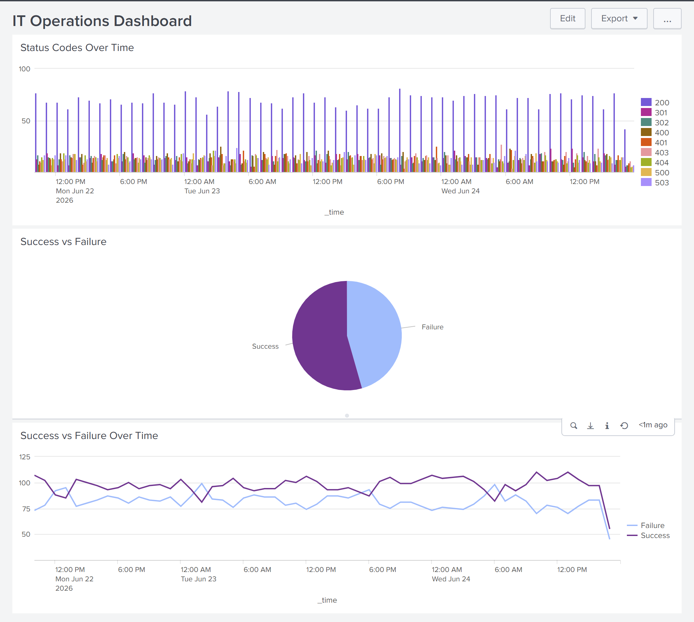
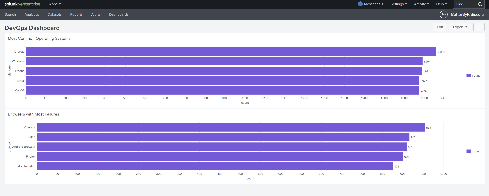
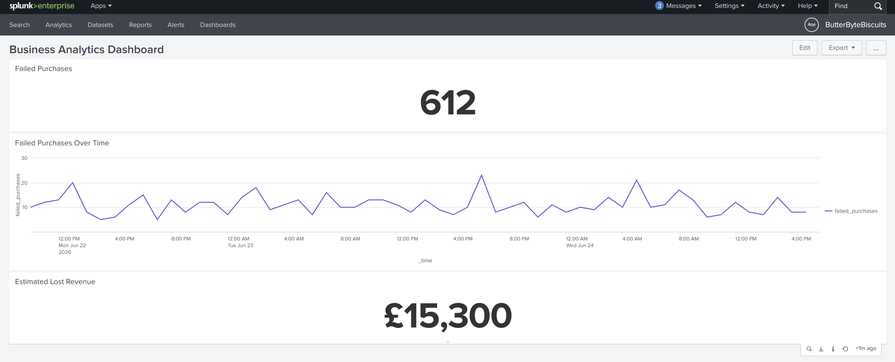
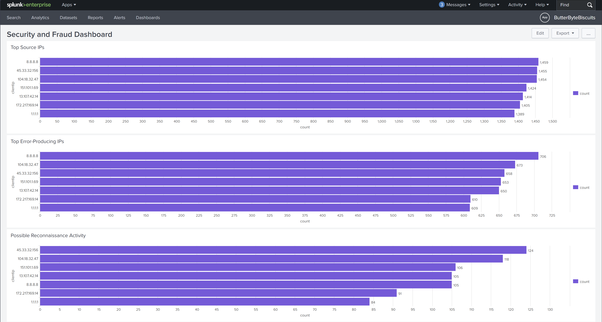
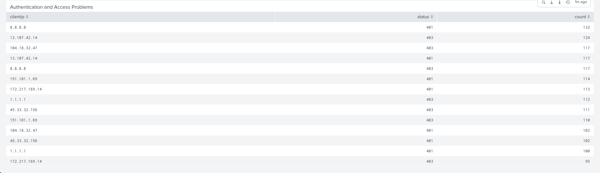
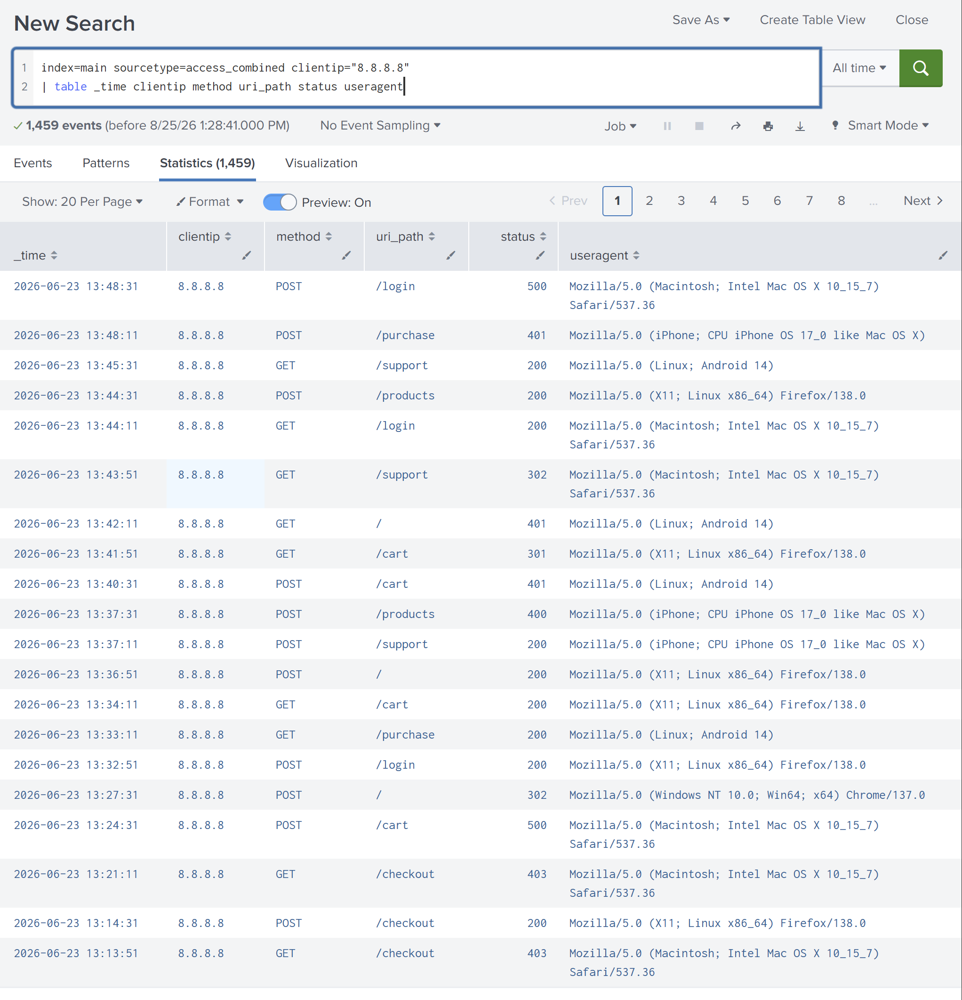
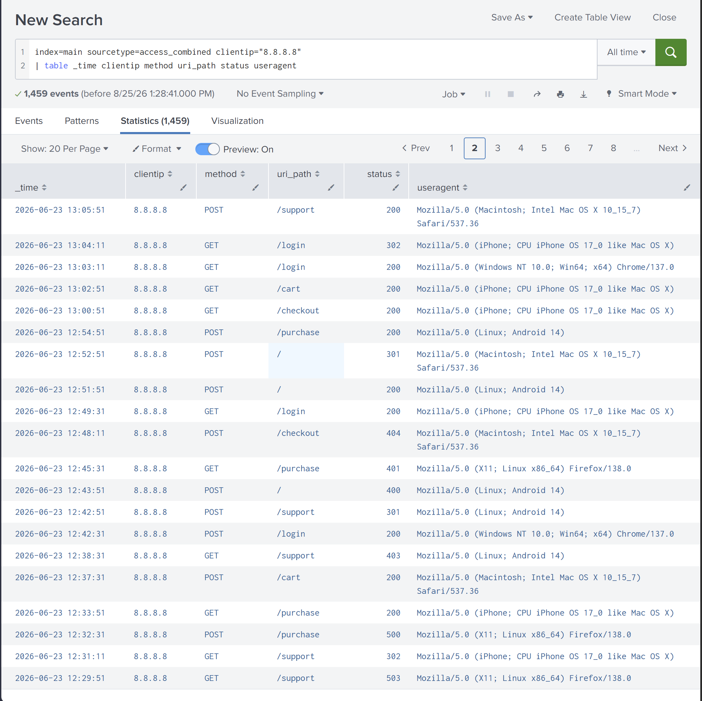
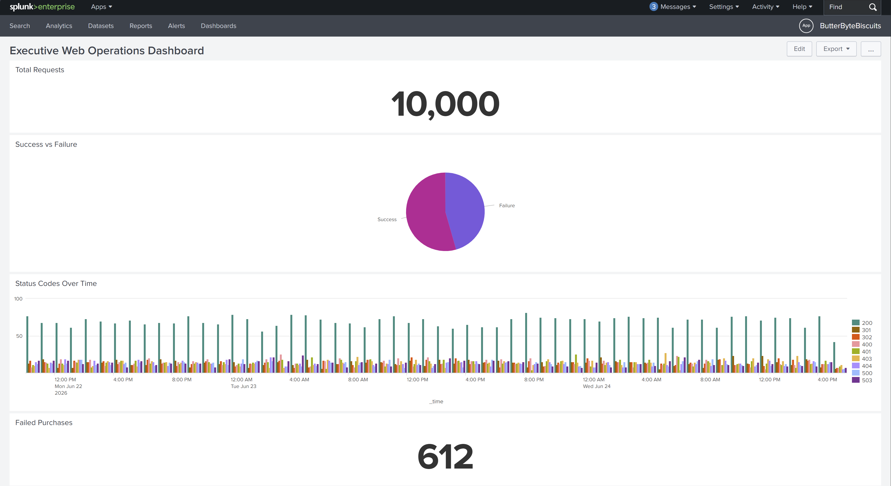
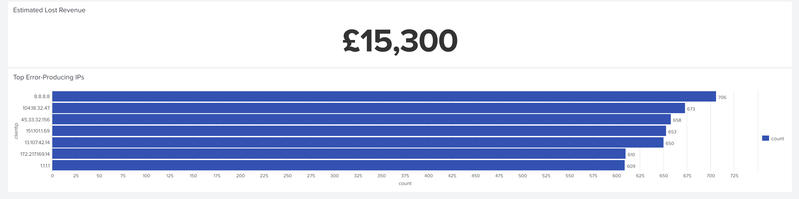

# Operation Biscuit Breach

## Splunk Web Operations, Security Monitoring & SOC Investigation

Operation Biscuit Breach is a Splunk-based web log analysis project demonstrating how operational, DevOps, business, and security teams can use centralised log data to monitor website performance, investigate failures, identify suspicious activity, assess business impact, and support SOC incident response.

The project analyses **10,000 simulated Apache-style web access events** using Splunk Enterprise. The investigation covers HTTP status-code monitoring, browser and operating-system analysis, failed purchases, estimated revenue loss, suspicious source IP activity, SOC Level 1 escalation, SOC Level 2 investigation, and incident-response analysis.

---

## Project Objectives

The project demonstrates how Splunk can be used to:

- Monitor website health and HTTP response codes.
- Analyse browser, operating-system, and platform activity.
- Identify failed purchase transactions and estimate potential revenue loss.
- Detect source IP addresses generating abnormal numbers of failed requests.
- Investigate potentially suspicious web activity.
- Escalate relevant activity from SOC Level 1 to SOC Level 2.
- Perform deeper incident-response analysis.
- Present technical and business findings through role-specific dashboards.

---

## Tools & Technologies

| Technology | Purpose |
|---|---|
| Splunk Enterprise | Log ingestion, searching, analysis, and dashboard creation |
| SPL (Search Processing Language) | Querying and analysing web access events |
| Python | Generation of simulated Apache-style web logs |
| Visual Studio Code | Project development and documentation |
| Git | Version control |
| GitHub | Project hosting and portfolio documentation |

---

## Dataset

The project uses a Python-generated dataset containing **10,000 simulated web access events**.

The log generator produces Apache-style web requests containing information such as:

- Source IP address
- Timestamp
- HTTP method
- Requested URI
- HTTP status code
- Response size
- Referrer
- User agent

The events were onboarded into Splunk using:

```spl
index=main sourcetype=access_combined
```

The `access_combined` sourcetype allows Splunk to interpret the web access events and expose fields required throughout the investigation, including `clientip`, `method`, `uri_path`, `status`, and `useragent`.

The Python log generator used for the project is available in:

```text
scripts/generate_weblogs.py
```

---

## Investigation Workflow

The project follows a multi-team investigation workflow:

```text
Web Access Logs
       │
       ▼
Splunk Enterprise
       │
       ├── IT Operations
       │     └── Website health & HTTP status monitoring
       │
       ├── DevOps
       │     └── Browser & operating-system analysis
       │
       ├── Business Analytics
       │     └── Failed purchases & estimated revenue loss
       │
       └── Security / Fraud
             └── Suspicious source IP analysis
                       │
                       ▼
                  SOC Level 1
                       │
                    Escalation
                       │
                       ▼
                  SOC Level 2
                       │
                       ▼
                Incident Response
```

---

# Key Findings

Analysis of the 10,000 web events produced several operational, business, and security findings.

### Website Activity

HTTP `200` was the most common response, with **3,905 successful requests**.

However, significant numbers of client and server errors were also observed, including:

- HTTP 400 — Bad Request
- HTTP 401 — Unauthorized
- HTTP 403 — Forbidden
- HTTP 404 — Not Found
- HTTP 500 — Internal Server Error
- HTTP 503 — Service Unavailable

Overall classification of the dataset produced:

- **5,441 successful requests**
- **4,559 failed requests**

### Business Impact

The analysis identified:

- **612 failed purchase requests**
- **£15,300 estimated potential lost revenue**

The revenue estimate assumes each failed purchase represents £25 in potential revenue.

### Browser Failures

Failed requests by browser included:

| Browser | Failed Requests |
|---|---:|
| Chrome | 955 |
| Safari | 917 |
| Android Browser | 910 |
| Firefox | 901 |
| Mobile Safari | 876 |

### Security Investigation

`8.8.8.8` generated the highest overall number of failed HTTP requests, with **706 errors**.

Further investigation identified repeated HTTP 401, 403, and 404 responses associated with the source.

This behaviour was escalated for deeper SOC investigation.

---

# IT Operations Analysis

The IT Operations investigation focused on website health and HTTP response behaviour.

Three primary SPL searches were used:

### Status Codes Over Time

```spl
index=main sourcetype=access_combined
| timechart span=1h count by status
```

### Success vs Failure

```spl
index=main sourcetype=access_combined
| eval result=if(status<400,"Success","Failure")
| stats count by result
```

### Success vs Failure Over Time

```spl
index=main sourcetype=access_combined
| eval result=if(status<400,"Success","Failure")
| timechart span=1h count by result
```

These searches provided visibility into successful requests, client-side errors, server-side failures, and changes in website behaviour over time.

## IT Operations Dashboard



---

# DevOps Analysis

The DevOps investigation examined the platforms and browsers interacting with the web application.

Analysis included:

- Top user agents
- Operating-system/platform distribution
- Browser-specific failures

An important issue was identified during platform classification: Android user-agent strings can also contain the word `Linux`.

If Linux is evaluated before Android, Android traffic may therefore be incorrectly classified as Linux.

The classification logic was adjusted so that Android is evaluated before the generic Linux condition, producing more accurate platform categorisation.

Browser failure analysis showed relatively similar failure volumes across the five simulated browser categories, with Chrome producing the highest number of failed requests.

## DevOps Dashboard



---

# Business Analytics

The Business Analytics investigation examined whether failed web requests could have an impact on sales.

### Failed Purchases

```spl
index=main sourcetype=access_combined uri_path="/purchase" status>=400
| stats count as failed_purchases
```

The investigation identified:

**612 failed purchase requests**

### Estimated Lost Revenue

Each failed purchase was assumed to represent **£25** in potential revenue.

```spl
index=main sourcetype=access_combined uri_path="/purchase" status>=400
| eval estimated_lost_revenue=25
| stats sum(estimated_lost_revenue) as total_lost_revenue
```

This produced an estimated potential revenue impact of:

**£15,300**

This figure represents an estimate rather than confirmed financial loss because a failed web request does not necessarily mean that the user would have completed the purchase.

## Business Analytics Dashboard



---

# Security & Fraud Investigation

The Security/Fraud investigation focused on identifying source IP addresses producing unusual quantities of failed requests.

The analysis included:

- Top source IP addresses
- Top source IPs generating errors
- Possible reconnaissance activity
- Possible authentication problems

### Error-Producing Source IPs

```spl
index=main sourcetype=access_combined status>=400
| stats count by clientip
| sort - count
```

The highest error-producing source was:

**8.8.8.8 — 706 failed requests**

Repeated HTTP failures alone do not prove malicious activity. However, the volume and combination of errors provided sufficient justification for additional investigation.

### Possible Reconnaissance

HTTP 404 activity was examined using:

```spl
index=main sourcetype=access_combined status=404
| stats count by clientip
| sort - count
```

Repeated requests resulting in `404 Not Found` responses can be relevant during reconnaissance analysis because they may indicate attempts to discover resources that do not exist or are not publicly exposed.

### Authentication and Access Failures

HTTP 401 and 403 activity was also analysed:

```spl
index=main sourcetype=access_combined status=401 OR status=403
| stats count by clientip status
| sort - count
```

These events can indicate authentication failures or attempts to access resources without sufficient permissions.

## Security & Fraud Dashboard





---

# SOC Level 1 Escalation

Following the Security/Fraud investigation, the activity associated with `8.8.8.8` was examined from a SOC Level 1 perspective.

The investigation considered:

- Repeated HTTP 404 responses
- HTTP 401 authentication failures
- HTTP 403 access-denied responses
- HTTP 500 and 503 server errors
- Overall request volume from the source

The investigated IP generated:

- **1,459 total web events**
- **132 HTTP 401 responses**
- **117 HTTP 403 responses**
- **105 HTTP 404 responses**

This resulted in **354 combined HTTP 401, 403, and 404 responses**.

The combination of repeated authentication failures, denied requests, unavailable resources, and overall request volume was considered sufficient to justify escalation to SOC Level 2 for additional investigation.

The escalation documentation is available in:

```text
documentation/escalation-note.md
```

---

# SOC Level 2 Investigation

SOC Level 2 enriched the available evidence by examining individual events associated with the source IP.

The following SPL was used:

```spl
index=main sourcetype=access_combined clientip="8.8.8.8"
| table _time clientip method uri_path status useragent
```

The search returned **1,459 events**.

The investigation examined:

- Event timestamps
- Source IP
- HTTP methods
- Requested URI paths
- HTTP response codes
- User-agent information

This provided greater context around the behaviour associated with the source.

## Investigation Evidence





---

# Incident Response

A mini incident-response playbook was developed for suspicious web activity.

The response process consists of five stages:

### 1. Validate the Alert

Confirm the source IP, HTTP status codes, time period, requested resources, and frequency of activity.

### 2. Enrich the Evidence

Use Splunk to retrieve additional event information including HTTP methods, URI paths, status codes, timestamps, and user agents.

### 3. Classify the Activity

Possible classifications include:

- Reconnaissance
- Authentication abuse
- Broken application link
- Server-side failure
- Possible denial of service
- False positive

### 4. Recommend Containment

Depending on severity, possible actions include:

- Continue monitoring
- Temporarily block the IP
- Rate-limit requests
- Investigate associated user accounts
- Notify the web/application team
- Raise an incident ticket

### 5. Document the Case

Record what happened, when it occurred, affected systems, evidence collected, who identified the activity, and the recommended response.

The complete playbook is available at:

```text
documentation/incident-response-playbook.md
```

---

# Executive Web Operations Dashboard

The final stage of the project consolidated operational, business, and security information into an executive-level Splunk dashboard.

The dashboard contains six panels:

1. Total Requests
2. Success vs Failure
3. Status Codes Over Time
4. Failed Purchases
5. Estimated Lost Revenue
6. Top Error-Producing IPs

This provides senior management with a consolidated view of:

- Website activity
- Website health
- Request failures
- Business impact
- Potential revenue loss
- Potential security risk

## Executive Dashboard





---

# Dashboards Created

| Dashboard | Purpose |
|---|---|
| IT Operations Dashboard | Website health and HTTP status monitoring |
| DevOps Dashboard | Browser, OS, and platform analysis |
| Business Analytics Dashboard | Failed purchases and estimated revenue impact |
| Security and Fraud Dashboard | Suspicious IPs and failed requests |
| Executive Web Operations Dashboard | Consolidated operational, business, and security view |

---

# Repository Structure

```text
splunk-soc-operation-biscuit-breach/
│
├── data/
│
├── documentation/
│   ├── escalation-note.md
│   ├── incident-response-playbook.md
│   └── final-report.md
│
├── screenshots/
│   ├── business-analytics/
│   │   └── business-analytics-dashboard.png
│   │
│   ├── devops/
│   │   └── devops-dashboard.png
│   │
│   ├── executive-dashboard/
│   │   ├── executive-dashboard-1.png
│   │   └── executive-dashboard-2.png
│   │
│   ├── incident-response/
│   │   ├── soc-l2-investigation-1.png
│   │   └── soc-l2-investigation-2.png
│   │
│   ├── it-operations/
│   │   └── it-operations-dashboard.png
│   │
│   └── security-investigation/
│       ├── security-and-fraud-dashboard-1.png
│       └── security-and-fraud-dashboard-2.png
│
├── scripts/
│   └── generate_weblogs.py
│
├── spl/
│   └── SPL search files
│
├── .gitattributes
└── README.md
```

---

# Skills Demonstrated

This project demonstrates practical experience with:

### SIEM & Log Analysis

- Splunk Enterprise
- Log ingestion and field analysis
- SPL query development
- Event filtering and aggregation
- Time-based analysis
- Dashboard development

### Security Operations

- Security monitoring
- Suspicious activity identification
- SOC Level 1 triage
- SOC escalation
- SOC Level 2 investigation
- Evidence enrichment
- Incident classification
- Incident-response planning

### Web Security Analysis

- HTTP status-code analysis
- Authentication failure analysis
- Access-denied activity
- Reconnaissance indicators
- Source IP analysis
- Web request investigation

### Operational & Business Analysis

- Website health monitoring
- Browser and platform analysis
- Failed transaction analysis
- Business-impact estimation
- Executive reporting

### Technical Documentation

- Investigation documentation
- Escalation notes
- Incident-response playbooks
- Git version control
- GitHub project documentation

---

# Key Takeaways

This project demonstrates that web access logs can provide information far beyond basic website traffic statistics.

The same dataset supported multiple organisational perspectives:

- **IT Operations** used the logs to assess website health.
- **DevOps** used them to examine browser and platform behaviour.
- **Business Analytics** connected technical failures with potential financial impact.
- **Security/Fraud** used them to identify unusual source activity.
- **SOC analysts** used them to investigate and escalate potentially suspicious behaviour.
- **Management** received a consolidated view through the Executive Web Operations Dashboard.

The investigation also highlights an important SOC principle: abnormal activity should be investigated within context rather than automatically classified as malicious. Repeated HTTP errors can provide useful indicators, but additional evidence is required before concluding that a security incident has occurred.

---

## Project Documentation

Additional investigation material is available in the `documentation/` directory:

- `escalation-note.md` — SOC Level 1 escalation documentation
- `incident-response-playbook.md` — SOC Level 2 response workflow
- `final-report.md` — Overall project findings

The SPL queries used throughout the investigation are available in the `spl/` directory.